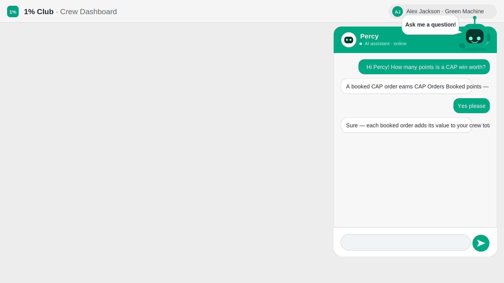
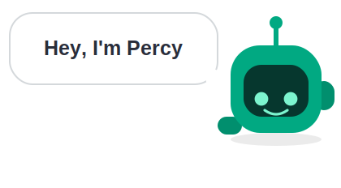
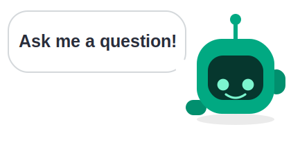
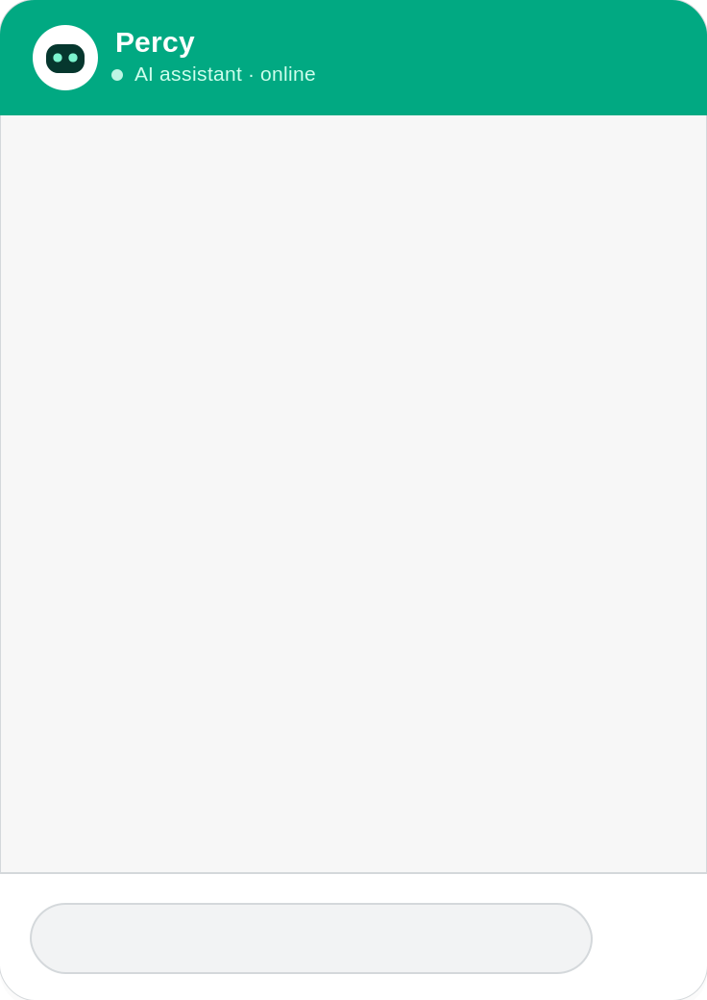

# Percy — the AI assistant (build guide)

Percy peers over the ribbon, waves, and pops the odd speech bubble. Tap him and a
chat window scales in from the top‑right; type a question, hit send, and a Power
Automate flow (wired up later) answers using a SharePoint knowledge list.

All visuals are **SVG/HTML data‑URIs** (same technique as the rest of the app) so
there are no image assets to manage.

---

## 1. Controls & formulas

| Control | Type | Property | Formula |
|---|---|---|---|
| **App** | — | `OnStart` | [`App_OnStart.powerfx`](formulas/dashboard/App_OnStart.powerfx) — seeds `varPercyOpen / varChatClosing / varChatKey / varPercyThinking / varSessionId / colChat` |
| `imgPercy` | Image | `Image` | [`imgPercy.Image.powerfx`](formulas/percy/imgPercy.Image.powerfx) — peering Percy + bubbles |
| `imgPercy` | Image | `OnSelect` | [`imgPercy.OnSelect.powerfx`](formulas/percy/imgPercy.OnSelect.powerfx) — open chat |
| **conPercyChat** | Container | `Visible` | `varPercyOpen` |
| `imgChatBg` | Image | `Image` | [`imgChatBg.Image.powerfx`](formulas/percy/imgChatBg.Image.powerfx) — window + entrance/exit |
| `imgClose` | Image | `Image` / `OnSelect` | [`imgClose.Image.powerfx`](formulas/percy/imgClose.Image.powerfx) · [`imgClose.OnSelect.powerfx`](formulas/percy/imgClose.OnSelect.powerfx) |
| `tmrCloseChat` | Timer | `OnTimerEnd` | [`tmrCloseChat.OnTimerEnd.powerfx`](formulas/percy/tmrCloseChat.OnTimerEnd.powerfx) |
| `galChat` | Gallery (blank vertical) | `Items` | [`galChat.Items.powerfx`](formulas/percy/galChat.Items.powerfx) — `Sort(colChat, Seq)` |
| `htmlBubble` (in galChat) | HTML text | `HtmlText` | [`htmlBubble.HtmlText.powerfx`](formulas/percy/htmlBubble.HtmlText.powerfx) |
| `txtChat` | Text input | — | `HintText="Ask Percy a question…"`, `BorderColor=Transparent`, `Fill=Transparent` |
| `imgSend` | Image | `Image` / `OnSelect` | [`imgSend.Image.powerfx`](formulas/percy/imgSend.Image.powerfx) · [`imgSend.OnSelect.powerfx`](formulas/percy/imgSend.OnSelect.powerfx) — `Patch` to SharePoint |
| `tmrPercyPoll` (in conPercyChat) | Timer | `OnTimerEnd` | [`tmrPercyPoll.OnTimerEnd.powerfx`](formulas/percy/tmrPercyPoll.OnTimerEnd.powerfx) — polls SharePoint for the reply |

Every Image: `ImagePosition = Fit`. **Data source:** add the `PercyMessages` SharePoint list
(standard connector — no premium). The send/poll round‑trip is in
[backend/README.md](formulas/percy/backend/README.md).

---

## 2. Layout

**Percy** lives on the ribbon (any screen you want him on). Put `imgPercy` near the
top‑right so he peers over the edge — e.g. `X=900 Y=26 W=210 H=116`. The whole image
is the tap target, so keep him in the corner where there are no live controls beneath
(nudge left/down if he overlaps the identity chip). He shows on a static render too,
so he's always "there".

**The chat** is a **Container `conPercyChat`** (`Visible = varPercyOpen`) so everything
shows/hides as one unit. Suggested container: `X=752 Y=60 Width=368 Height=520`.
Children use coordinates **relative to the container**:

| Child | X | Y | W | H | Notes |
|---|---:|---:|---:|---:|---|
| `imgChatBg` | 0 | 0 | 368 | 520 | back layer — animates in/out |
| `imgClose` | 324 | 16 | 28 | 28 | on the green header — animates in/out with the bg |
| `galChat` | 16 | 72 | 336 | 374 | messages · **`Visible = !varChatClosing`** |
| `txtChat` | 28 | 470 | 264 | 36 | transparent over the baked pill · **`Visible = !varChatClosing`** |
| `imgSend` | 312 | 470 | 40 | 40 | send — animates in/out with the bg (leave `Visible` default) |
| `tmrCloseChat` | 0 | 0 | 0 | 0 | `Visible=false` |
| `tmrPercyPoll` | 0 | 0 | 0 | 0 | `Visible=false` · `Start=varPercyThinking` `Repeat=true` `Duration=2000` |

> **Smooth close:** the gallery + text input use `Visible = !varChatClosing`, so they vanish the
> instant you press close; `imgChatBg`, `imgClose` and `imgSend` (all driven by the same
> `varChatClosing` / `varChatKey`) animate away together, then `tmrCloseChat` hides the container.

`galChat`: blank **vertical** gallery, `TemplatePadding=2`. Inside it one **HTML text**
control `htmlBubble` (`X=0 Y=0 Width=Parent.TemplateWidth`, **`AutoHeight=true`**) with
`HtmlText` = the bubble formula. Turn on the gallery's flexible/auto height so bubbles
size to their text.

> **Prefer one control over a gallery?** You can drop the gallery and render the whole
> transcript in a single AutoHeight HTML text control with
> `Concat( Sort(colChat, Seq), <the htmlBubble markup> )`, placed inside a 1‑row
> scrolling gallery. Same bubble markup; no per‑item height fuss.

### Open / close animation (no screen switch)
- **Open:** `imgPercy.OnSelect` sets `varPercyOpen=true`, `varChatClosing=false`, and
  bumps `varChatKey`. `imgChatBg`'s `<desc>` contains `varChatKey`, so the image reloads
  and replays its **`cin`** (scale‑up from the top‑right) animation.
- **Close:** `imgClose.OnSelect` sets `varChatClosing=true` (+ bumps `varChatKey`). The
  gallery + text input hide instantly (`Visible = !varChatClosing`), while `imgChatBg`,
  `imgClose` and `imgSend` reload and play **`cout`** (scale‑down) — same vars, so they move
  together. The container is *still visible*.
- **Then hide:** `tmrCloseChat` (`Start=varChatClosing`, `Duration=360`, `Repeat=false`)
  fires when the exit finishes and sets `varPercyOpen=false` (and clears `varChatClosing`).
  Navigation never depends on the timer — only the final hide does.

---

## 3. Data model

`colChat` rows: `{ Seq: Number, Role: "user" | "percy", Body: Text }`. `App.OnStart`
seeds Percy's greeting. `varSessionId` (a `GUID()`) tags the conversation so the flow /
SharePoint can group it.

---

## 4. SharePoint + Power Automate (wire up later)

Percy's brain — the SharePoint list, the `PercyAsk` flow, the scoring prompt, and the
updated `imgSend.OnSelect` that sends the conversation as **JSON** — has its own full guide:
**[backend/README.md](formulas/percy/backend/README.md)**.

- **Stage 1 (FAQ):** one AI prompt you write (how points are scored) answers questions; every
  conversation is logged to a `PercyConversations` list as JSON.
- **Stage 2 (later):** "why isn't my opp scoring?" reasoning over the user's own data — not
  built yet, hooks noted in that doc.

Until you build it, the stub in
[`imgSend.OnSelect.powerfx`](formulas/percy/imgSend.OnSelect.powerfx) collects a placeholder
reply so the whole UI is testable now.

---

## 5. Components
| | |
|---|---|
| Percy (two bubbles) |   |
| Chat window · Send · Close |    |

## 6. Notes
- **Typing indicator:** `varPercyThinking` is set while awaiting the reply — show a small
  "Percy is typing…" label/HTML bubble bound to it if you like.
- **Send on Enter:** Text input has no native Enter event; keep the send button (or use a
  hidden button with a keyboard shortcut component).
- **Reduced motion:** every Percy/chat animation honours `prefers-reduced-motion`.
