# 1% Club — Crew Dashboard (PowerApps + Power BI, HPE Design System)

Data‑driven **SVG image controls** for a **locked 1136 × 640** PowerApps screen, fed from
`PowerBIIntegration.Data`. A top ribbon spans the page; the right column is the **Crew
Leaderboard** (podium for 1‑3, gallery for 4‑10); the left column is **role‑aware**:

| Viewer role | Detected when their email is… | Left column shows | Leaderboard |
|---|---|---|---|
| **Member** | in **`User Email`** | **My Points** (their own breakdown) + their crew grid | their crew flagged **YOUR CREW** |
| **Sponsor** | in **`Manager Sponsor Email`** | **sponsored‑crew summary** + that crew's grid | sponsored crew flagged **YOU SPONSOR** |
| **Spectator** | in neither | **auto‑scrolling tour** of every crew's points breakdown | (no flag) |

Layout follows the HPE [two‑column dashboard](https://design-system.hpe.design/templates/dashboards#two-column-dashboard);
colours are the HPE [semantic / dataVis tokens (light)](https://design-system.hpe.design/design-tokens/all-design-tokens?token=semantic%2Fcolor&tokenTypes=docs&mode=light).

**Member**
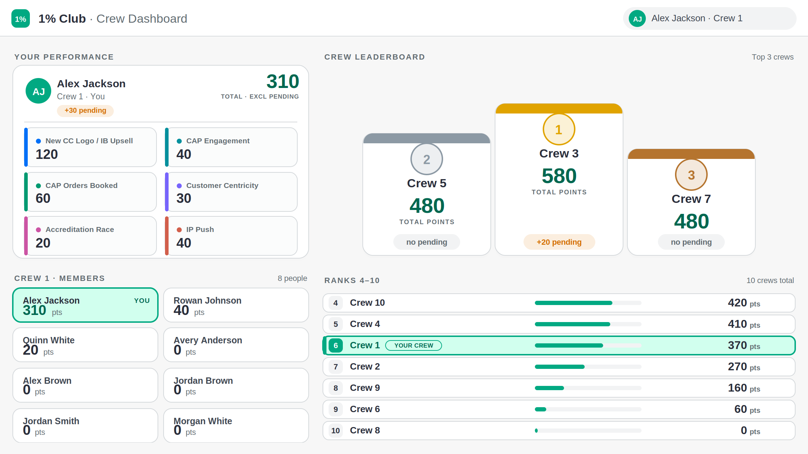
**Sponsor** &nbsp;·&nbsp; **Spectator**
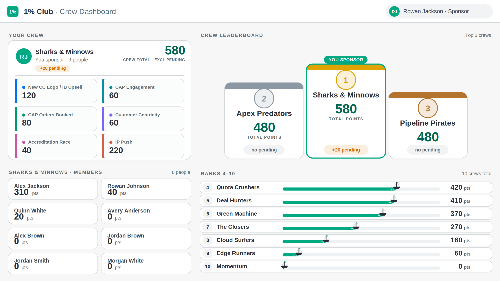
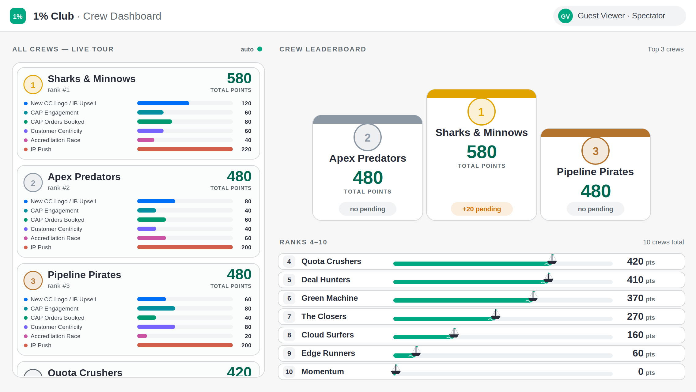

---

## 1. Controls & formulas

| Control | Type | Property | Formula |
|---|---|---|---|
| **App** | — | `OnStart` | [`App_OnStart.powerfx`](formulas/App_OnStart.powerfx) — `Set(varReady,false)` |
| `imgLoading` (on **scrLoading**, the 1st screen) | Image | `Image` | [`imgLoading.Image.powerfx`](formulas/imgLoading.Image.powerfx) |
| `tmrGo` (on scrLoading) | Timer | `OnTimerEnd` | [`tmrGo.OnTimerEnd.powerfx`](formulas/tmrGo.OnTimerEnd.powerfx) — auto‑enter when data ready |
| `btnEnter` (on scrLoading) | Button | `OnSelect` | [`btnEnter.OnSelect.powerfx`](formulas/btnEnter.OnSelect.powerfx) — manual fallback |
| **scrDashboard** | Screen | `OnVisible` | [`Screen_OnVisible.powerfx`](formulas/Screen_OnVisible.powerfx) — **builds all data** |
| `imgRibbon` | Image | `Image` | [`imgRibbon.Image.powerfx`](formulas/imgRibbon.Image.powerfx) |
| `imgMyPoints` | Image | `Image` | [`imgMyPoints.Image.powerfx`](formulas/imgMyPoints.Image.powerfx) |
| `imgCrewGrid` | Image | `Image` | [`imgCrewGrid.Image.powerfx`](formulas/imgCrewGrid.Image.powerfx) |
| `imgSpectator` | Image | `Image` | [`imgSpectator.Image.powerfx`](formulas/imgSpectator.Image.powerfx) |
| `imgPodium` | Image | `Image` | [`imgPodium.Image.powerfx`](formulas/imgPodium.Image.powerfx) |
| `imgRanksHeader` | Image | `Image` | [`imgRanksHeader.Image.powerfx`](formulas/imgRanksHeader.Image.powerfx) |
| `galLeaderboard` | Gallery (blank vertical) | `Items` | `colCrewRest` |
| `imgRow` (in gallery) | Image | `Image` | [`imgRow.Image.powerfx`](formulas/imgRow.Image.powerfx) |

Every Image: **`ImagePosition = ImagePosition.Fit`**.

---

## 2. Layout — locked 1136 × 640

Screen `Fill = RGBA(247,247,247,1)` (`background-back #f7f7f7`). Each image's viewBox matches
its rectangle's aspect, so it fills with no letterboxing.

| Control | X | Y | Width | Height | Visible |
|---|---:|---:|---:|---:|---|
| `imgRibbon` | 0 | 0 | 1136 | 52 | `true` |
| `imgMyPoints` | 16 | 68 | 420 | 300 | `varRole <> "spectator"` |
| `imgCrewGrid` | 16 | 380 | 420 | 244 | `varRole <> "spectator"` |
| `imgSpectator` | 16 | 68 | 420 | 556 | `varRole = "spectator"` |
| `imgPodium` | 452 | 68 | 668 | 300 | `true` |
| `imgRanksHeader` | 452 | 380 | 668 | 28 | `true` |
| `galLeaderboard` | 452 | 412 | 668 | 212 | `true` |
| `recLoading` (Rectangle, optional) | 0 | 0 | 1136 | 640 | `!varReady` |
| `lblLoading` (Label, optional, "Loading crew data…") | 0 | 0 | 1136 | 640 | `!varReady` |

**Gallery** `galLeaderboard`: `Items = colCrewRest`, `TemplateSize = 30`, `TemplatePadding = 0`,
`ShowScrollbar = false`. Inside it, one Image `imgRow`: `X=0 Y=0`,
`Width = Parent.TemplateWidth`, `Height = Parent.TemplateHeight`, `ImagePosition = Fit`.
(7 rows × 30 = 210 ≈ 212 → all of ranks 4‑10 show without scrolling.)

`imgMyPoints`/`imgCrewGrid` (member & sponsor) and `imgSpectator` occupy the **same** left
column and are swapped purely by their `Visible` rule — no screen switching.

### Loads on open — land on a splash screen, then enter the dashboard

The data build lives in **`scrDashboard.OnVisible`** and runs every time the screen is shown —
**navigating in always builds correctly** (the data is there by then). The only gotcha is the
*very first* open: `PowerBIIntegration.Data` lands a beat after the screen first appears, so a
cold open can be blank. Fix it by **opening on a small landing screen** and entering the
dashboard once data is ready:

1. **`scrLoading`** = the app's **first screen**. Put `imgLoading`
   ([`imgLoading.Image.powerfx`](formulas/imgLoading.Image.powerfx)) full‑screen — a branded
   "Loading crew dashboard…" splash with a spinning ring (self‑contained, no data needed).
2. **Auto‑advance:** Timer `tmrGo` on `scrLoading` (`AutoStart=true`, `Repeat=true`,
   `Duration=500`), `OnTimerEnd` = [`tmrGo.OnTimerEnd.powerfx`](formulas/tmrGo.OnTimerEnd.powerfx)
   → `If(CountRows(PowerBIIntegration.Data)>0, Navigate(scrDashboard,…))`. The instant data
   arrives it enters the dashboard, whose `OnVisible` then builds with data present.
3. **Guaranteed fallback:** a Button `btnEnter` ("View dashboard"),
   `OnSelect` = [`btnEnter.OnSelect.powerfx`](formulas/btnEnter.OnSelect.powerfx). If timers don't
   fire in your visual, one tap still works — exactly the "navigate in" path that already works.

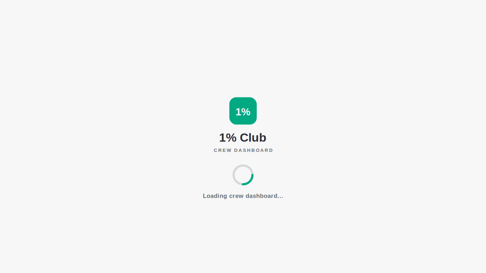

> **Build gotchas already handled in `OnVisible`:** (1) a **blank numeric cell throws on read**
> ("expected 'number' but got 'string'") — every point cell is read with `IfError(pbi.col,0)`
> (`Coalesce`/`Value` can't help; the error is at field access). (2) this environment rejects
> `GroupBy`/`SortByColumns` **string column names** — so the build uses
> `Distinct`/`Filter`/`Sum`/`Sort(<expression>)`/`ForAll` instead.

#### Still blank? Add the diagnostic labels
Add Labels with `Text =` [`lblDebug.Text.powerfx`](formulas/lblDebug.Text.powerfx) and
[`lblDebugSchema.Text.powerfx`](formulas/lblDebugSchema.Text.powerfx) — see **[DEBUG.md](DEBUG.md)**:

| Reading | Meaning → fix |
|---|---|
| `rows=0` always | Power BI is sending **no rows** — add the fields to the PowerApps visual's data well. |
| `rows>0` but `colMembers=0` | Build didn't run / errored. If `varRole` is **blank** → build never ran (don't use a Timer; use `OnVisible`). If you see a red **JSON `expected 'number' got 'string'`** → a numeric column arrives as text (OnVisible already coerces via `Value(field & "")`; else set it to Whole Number in Power BI). Check names/values with `lblDebugSchema`. |
| `colMembers>0`, visuals blank | Image controls not on the latest formulas / wrong `Visible` rules. |

Delete the debug labels once it works.

---

## 3. Roles (built in `OnVisible`)

```
varUserEmail  = Lower(User().Email)
varMemberRec  = LookUp(colMembers, Lower('User Email')          = varUserEmail)
varSponsorRec = LookUp(colMembers, Lower('Manager Sponsor Email')= varUserEmail)
varRole       = member | sponsor | spectator
varMyCrew     = the crew to feature on the left + flag on the board (Blank for spectator)
varMyCrewTag  = "YOUR CREW" (member) | "YOU SPONSOR" (sponsor)
```

- **Member** → `imgMyPoints` shows their personal 6‑category breakdown; `imgCrewGrid` shows
  their crew with the **YOU** tile highlighted.
- **Sponsor** → `imgMyPoints` becomes a **crew summary** (crew total + the 6 categories summed
  for the crew); `imgCrewGrid` shows that crew (no personal highlight).
- **Spectator** → `imgSpectator` slowly auto‑scrolls a card per crew (rank, total, and a mini
  bar per category) — a hands‑off "kiosk" tour. Speed/scroll length scale with crew count.
- **Crew flag** → on the podium and gallery, the row/card whose `Crew = varMyCrew` gets a green
  outline + a `varMyCrewTag` chip. Spectators see no flag.

> **Test a role** without changing accounts: after `OnVisible` runs, set
> `Set(varUserEmail, "jordan.smith@example.com")` (member) /
> a `Manager Sponsor Email` value (sponsor) / a non‑existent email (spectator) and re‑run.

---

## 4. Data model & scoring

`PowerBIIntegration.Data` columns arrive as in the sheet — note spaces / `&` / `?`, so Power Fx
wraps them in single quotes, e.g. `'IB & NS Points'`.

**Counted toward totals:** `IB & NS Points` · `Manager Sponsor Points` · `New CC Logo Points` ·
`Cap Won Points` · `Cap Requests` · `Customer Centricity Points` · `IP in GL points`.
**Pending** = the three `*Pending` columns.

```
MemberTotal = sum of the 7 point columns (excl. pending)
CrewTotal   = sum of MemberTotal over the crew      Rank = crews by CrewTotal desc (ties: lower #)
Pending     = sum of the *Pending columns           "points pending" = per-crew Pending
```

**Category re‑labels** (My Points / Crew summary / Spectator):

| Label | Source |
|---|---|
| New CC Logo / IB Upsell | `IB & NS Points` + `New CC Logo Points` |
| CAP Engagement | `Cap Requests` |
| CAP Orders Booked | `Cap Won Points` |
| Customer Centricity | `Customer Centricity Points` |
| Accreditation Race | `Manager Sponsor Points` |
| IP Push | `IP in GL points` |

Collections built in `OnVisible`: `colMembers` → `colCrew` (ranked) → `colCrewRest` (4‑10),
`colCrewBreak` (per‑crew category sums, for sponsor box + spectator), `colMyCrew` (viewer's crew,
grid), plus the role / box / `varSvgCss` variables.

### Components
| | |
|---|---|
| Ribbon | 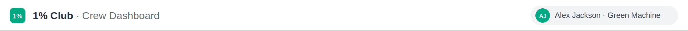 |
| My Points (member) · Crew summary (sponsor) | 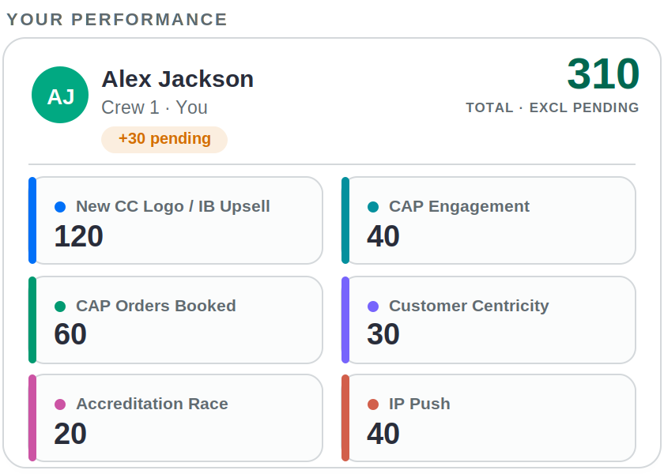 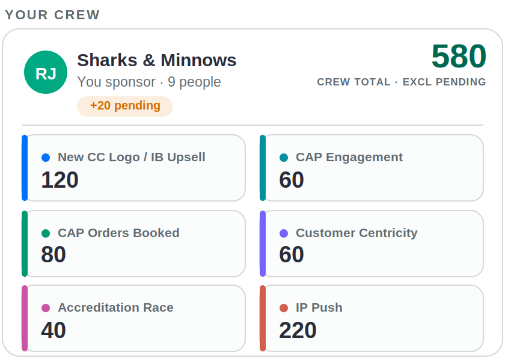 |
| Crew grid · Podium | 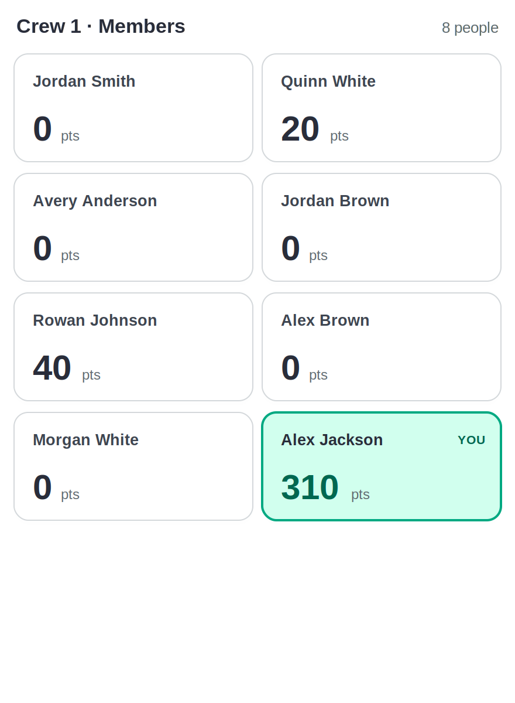 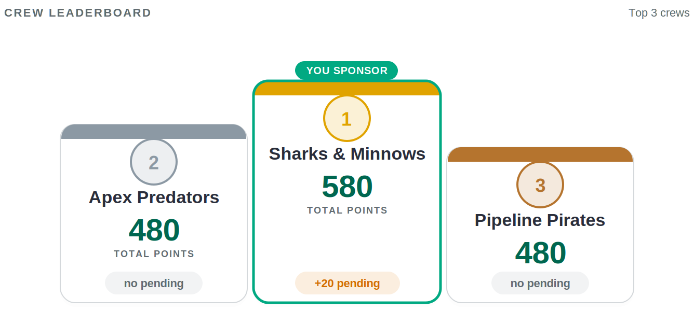 |
| Gallery rows · Spectator tour | 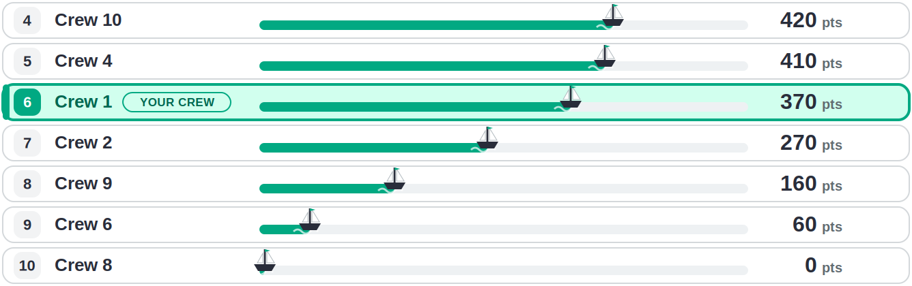 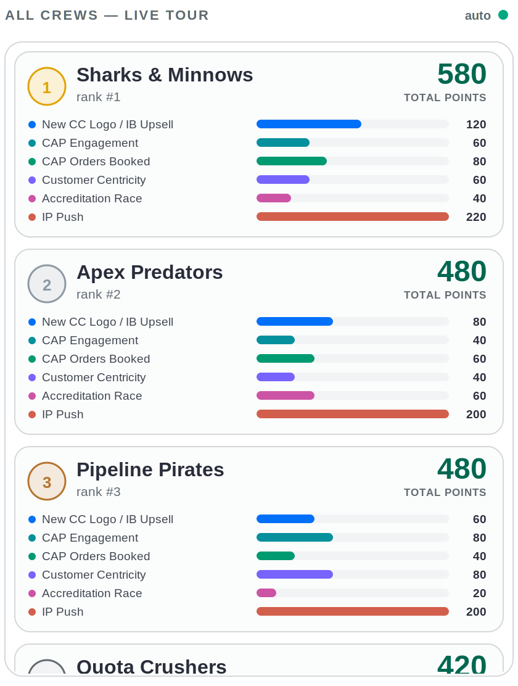 |

---

## 5. HPE colour tokens (light)

`background-back #f7f7f7` · card `#ffffff` · contrast `#f2f3f4` · border `#d4d8db` ·
text `#292d3a / #3e4550 / #606a70` · brand green `#01a982` · dark green `#006750` ·
green tint `#d1ffee` · warning `#d36d00`. Category accents (dataVis categorical):
`#0070f8 #04909d #009a71 #7764fc #cc54a4 #d25f4b`. Medals gold/silver/bronze
`#E0A300 #8C99A4 #B5742E`.

---

## 6. Animations (motion)

CSS keyframes embedded in each SVG (`<style>`), defined once as `varSvgCss` in `OnVisible`.
Runs in PowerApps' WebView2 image rendering; hidden start‑states live only in `@keyframes` so
static/`reduced-motion` renders show the settled design. **Honours `prefers-reduced-motion`.**

- **Ribbon / My Points / Crew summary**: fade‑up; avatar pops + idle halo; cards fade in
  staggered; pending chip pulses.
- **Podium**: cards rise (winner last); medals pop; gold champion halo; the flagged card draws
  a green outline + chip.
- **Gallery**: rows slide in staggered by rank; bar grows; the flagged row tints + chip.
- **Crew grid**: tiles pop in staggered; **YOU** tile breathes.
- **Spectator**: continuous slow vertical auto‑scroll (`scrl`) through all crews.

---

## 7. Gotchas

- **Dynamic SVG**: `"data:image/svg+xml;utf8," & EncodeUrl( "<svg…>" & values & "</svg>" )` on an
  Image. Single quotes for all attributes; `EncodeUrl` round‑trips the markup.
- **Repeats** use `Concat()` over a collection / inline `Table()` — that's how non‑gallery
  visuals draw N members / 3 podium slots / 6 categories / 10 spectator cards.
- **Coordinates are integers** (delays in `ms`, `Int()`/`Round()` for sizes) to avoid locale
  decimal separators breaking SVG geometry.
- **Text escaping**: human names pass through `Substitute(… & < >)`. `·` and `–` in labels are
  safe (EncodeUrl‑encoded, not XML metacharacters).
- **Font**: `Segoe UI` (native in PowerApps). Swap to `'Metric, Segoe UI, …'` to match HPE exactly.
- **`Index(colCrew,n)`** → `Last(FirstN(colCrew,n))` on older Power Fx.
- **Who am I**: `User().Email`. In a Power BI custom‑visual context, feed the email via
  `PowerBIIntegration` and set `varUserEmail` from it instead.

---

## 8. Regenerate / verify (optional)

```bash
pip install cairosvg openpyxl
python3 _generate_previews.py    # writes svg/ + previews/ (member, sponsor, spectator)
python3 _verify_powerfx_svg.py   # XML-validates the SVGs + structural-checks the .powerfx
```
